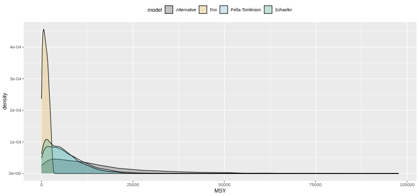
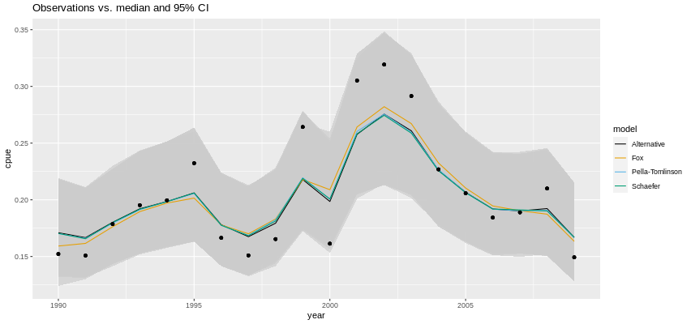

Motivation
----------

This document was prepared as a supplement to the review provided to A.
Baset, regarding the research article entitled “Maximum Sustainable
Yield of Dolphinfish, Coryphaena hippurus (Linnaeus, 1758) Fishery in
Pakistan”, available in
[Researchgate](https://www.researchgate.net/publication/342139244_Maximum_Sustainable_Yield_of_Dolphinfish_Coryphaena_hippurus_Linnaeus_1758_Fishery_in_Pakistan).
While the authors used the software CEDA (Catch Effort Data Analysis) to
fit three stock assessment models to dolphinfish catch-and-effort data
in Pakistan, here I use the `R` package
[`rcsurplus1d`](https://github.com/rtlemos/rcsurplus1d), by [Rankin and
Lemos
(2015)](https://www.researchgate.net/publication/279962333_An_alternative_surplus_production_model?_sg=VN8vMy1EvU8hSo7Fxzqaob_lVAwjzXROjHvcotff2oCFgmm3TVVVBGLz89dExHlwbt5gLlvtVOgihn8).

Data and models
---------------

The data are kindly provided by the authors, in Table 1. The models I
use are the same as Baset et al. (2020) – Schaeffer, Fox, and
Pella-Tomlinson –, plus the alternative model of Rankin and Lemos
(2015). For all models, I ran the MCMC for 100,000 iterations with 50%
burn-in and 1:10 thinning factor, resulting in 5,000 variates from the
posterior distribution.

Results
-------

Out of the four models, the Fox model provided the lowest value of DIC
(Table 1), which is why I will focus on it.

\*\*\* Table 1. Fox model summary
\*\*\*\*\*\*\*\*\*\*\*\*\*\*\*\*\*\*\*\*\*\*\*\*\*\*\*\*\*\*\*\*\*\*\*\*\*\*\*\*\*\*\*\*\*
Inference for Bugs model at “/tmp/RtmpZgSzFO/fox\_model.txt”, Current: 1
chains, each with 10000 iterations (first 5000 discarded), n.thin = 10
Cumulative: n.sims = 5000 iterations saved mean sd 2.5% 25% 50% 75%
97.5% K 72510.1 18374.6 33289.5 59457.5 74965.0 87845.0 98650.2 r 0.5
0.3 0.0 0.2 0.5 0.7 1.0 lq -13.0 0.4 -13.6 -13.2 -13.0 -12.8 -12.1
lsigma -3.7 0.3 -4.3 -4.0 -3.8 -3.5 -3.0 MSY 1190.7 764.7 57.2 550.6
1107.0 1757.2 2747.0 BMSY 26674.9 6759.7 12249.7 21870.0 27580.0 32320.0
36290.0 FMSY 0.0 0.0 0.0 0.0 0.0 0.1 0.1 mean\[1\] -1.8 0.1 -2.1 -1.9
-1.8 -1.8 -1.6 mean\[2\] -1.8 0.1 -2.0 -1.9 -1.8 -1.8 -1.6 mean\[3\]
-1.7 0.1 -1.9 -1.8 -1.7 -1.7 -1.5 mean\[4\] -1.7 0.1 -1.9 -1.7 -1.7 -1.6
-1.4 mean\[5\] -1.6 0.1 -1.8 -1.7 -1.6 -1.6 -1.4 mean\[6\] -1.6 0.1 -1.8
-1.7 -1.6 -1.5 -1.4 mean\[7\] -1.7 0.1 -1.9 -1.8 -1.7 -1.7 -1.5
mean\[8\] -1.8 0.1 -2.0 -1.8 -1.8 -1.7 -1.6 mean\[9\] -1.7 0.1 -1.9 -1.8
-1.7 -1.6 -1.5 mean\[10\] -1.5 0.1 -1.7 -1.6 -1.5 -1.5 -1.3 mean\[11\]
-1.6 0.1 -1.8 -1.6 -1.6 -1.5 -1.3 mean\[12\] -1.3 0.1 -1.5 -1.4 -1.3
-1.3 -1.1 mean\[13\] -1.3 0.1 -1.5 -1.3 -1.3 -1.2 -1.1 mean\[14\] -1.3
0.1 -1.5 -1.4 -1.3 -1.2 -1.1 mean\[15\] -1.5 0.1 -1.7 -1.5 -1.5 -1.4
-1.2 mean\[16\] -1.6 0.1 -1.8 -1.6 -1.6 -1.5 -1.3 mean\[17\] -1.6 0.1
-1.8 -1.7 -1.6 -1.6 -1.4 mean\[18\] -1.7 0.1 -1.9 -1.7 -1.7 -1.6 -1.5
mean\[19\] -1.7 0.1 -1.9 -1.8 -1.7 -1.6 -1.5 mean\[20\] -1.8 0.1 -2.1
-1.9 -1.8 -1.7 -1.6 deviance -18.3 6.1 -29.1 -22.7 -18.7 -14.5 -5.1

DIC info (using the rule, pD = Dbar-Dhat) pD = 6.6 and DIC = -11.8 DIC
is an estimate of expected predictive error (lower deviance is better).
\*\*\*\*\*\*\*\*\*\*\*\*\*\*\*\*\*\*\*\*\*\*\*\*\*\*\*\*\*\*\*\*\*\*\*\*\*\*\*\*\*\*\*\*\*\*\*\*\*\*\*\*\*\*\*\*\*\*\*\*\*\*\*\*

All models struggled to provide a narrow distribution for the carrying
capacity parameter K (Figure 1).

 With the exception of the Fox model, the posterior
distribution of MSY displayed a heavy right tail (Figures 2a and 2b),
signalling considerable uncertainty about this quantity.

Models differed in terms of their estimates of *B**M**S**Y*,
with the Fox model providing higher density between 30 and 35 thousand
tonnes.

 The Fox model provided a slightly lower posterior
mean for the log-transformed measurement error variance parameter *σ*
(Figure 4).

 Models were mostly in good agreement
regarding the log-catchability parameter *χ*, although the Fox model
provided slightly lower estimates (Figure 5).

 Finally, in terms of fit, the Fox model is again
the only model that provides slightly different estimates, which appear
to fit the data a little better (Figure 6).

 With respect to initial (i.e.,
1990) depletion, the Fox model estimates it around 16.5%, with 95%
credibility interval (13.5%, 22.3%). These numbers were obtained by
exponentiating the values of `mean[1]` in Table 1.

### Conclusion

In comparison to CEDA, package `rcsurplus1d` provides closer fits to the
data (compare Fig 7 above with Fig 1 of Baset et al., 2020). The Fox
model appears to provide slightly better estimates overall, and its 95%
CI for MSY is (57.2 t, 2747.0 t), with mean equal to 1190 tonnes. There
is some overlap with the MSY estimates provided by Baset et al. (2020),
although the mean provided by their models is higher. The initial
depletion estimated here (16.5%) is also lower than the 30% value
selected by Baset et al. (2020).
